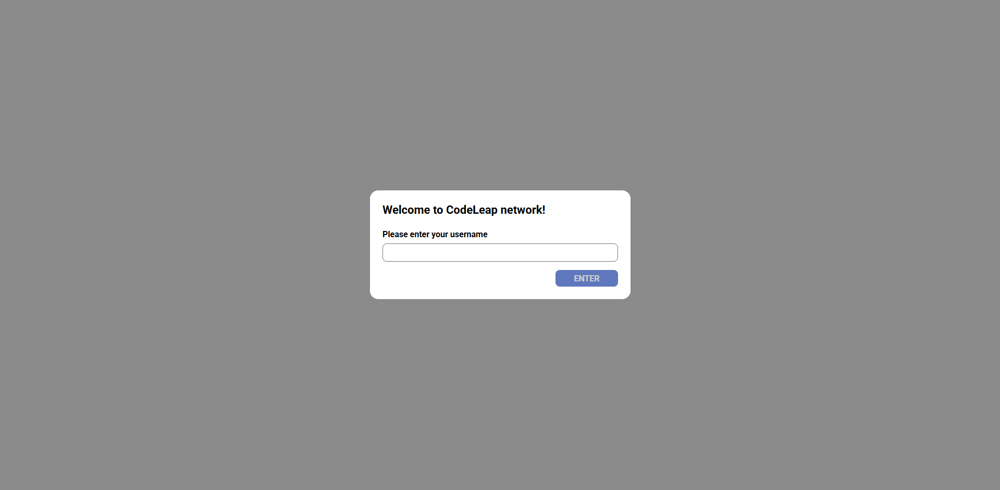
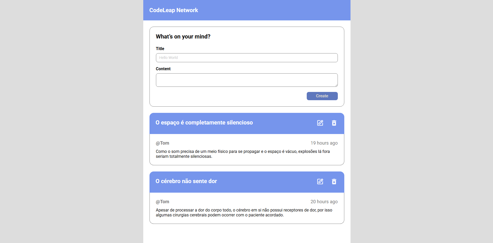

# 🚀 CodeLeap Network – Frontend Challenge

Frontend implementation of the **CodeLeap Network** recruitment challenge.

This project simulates a simple social feed where users can create, edit and delete posts.  
The interface strictly follows the design specifications provided in the assessment.

🔗 **Live Demo:** https://codeleap-network-challenge.vercel.app/

---

## 📌 Overview

The goal of this challenge was to build a clean, user-friendly interface targeted at end users.

Users can:

- Enter a username
- Create posts with title and content
- View posts in a feed
- Edit posts
- Delete posts with confirmation
- See loading and empty states

The project focuses on:

- Clean UI
- Usability
- Consistency
- Performance
- Code organization

---

## 🖥 Screenshots

### 🔐 Login Screen


### 📰 Feed Screen


---

## ⚡ Features

- Username entry modal
- Post creation form
- Edit post functionality
- Delete post with confirmation modal
- Optimistic UI updates using cache manipulation
- Loading states
- Empty states
- Responsive layout
- Component-based architecture

---

## 🛠 Tech Stack

- **React**
- **TypeScript**
- **TanStack React Query**
- **React Hook Form**
- **SCSS Modules**
- **Vite**

---

## ⚙️ Getting Started

### 1️⃣ Clone repository

```bash
git clone https://github.com/WevertonRibeiro/codeleap-network.git
```
```bash
cd codeleap-network
```

### 2️⃣ Install dependencies

```bash
npm install
```

### 3️⃣ Run project

```bash
npm run dev
```

### Open browser at:

```bash
http://localhost:5173
```

### 🧠 Architecture

```bash
src/
├── components/        # Reusable UI components
├── features/          # Feature-based modules (posts)
├── hooks/             # Custom hooks
├── contexts/          # Global state (username)
├── pages/             # Route pages
├── utils/             # Helpers
└── styles/            # Global styles
```

### 🔮 Possible Improvements

- Pagination or infinite scroll
- Authentication system
- Real-time updates (WebSocket)
- Unit & integration tests
- Dark mode

### 👨‍💻 Author
Developed as part of a Frontend Recruitment Challenge.
